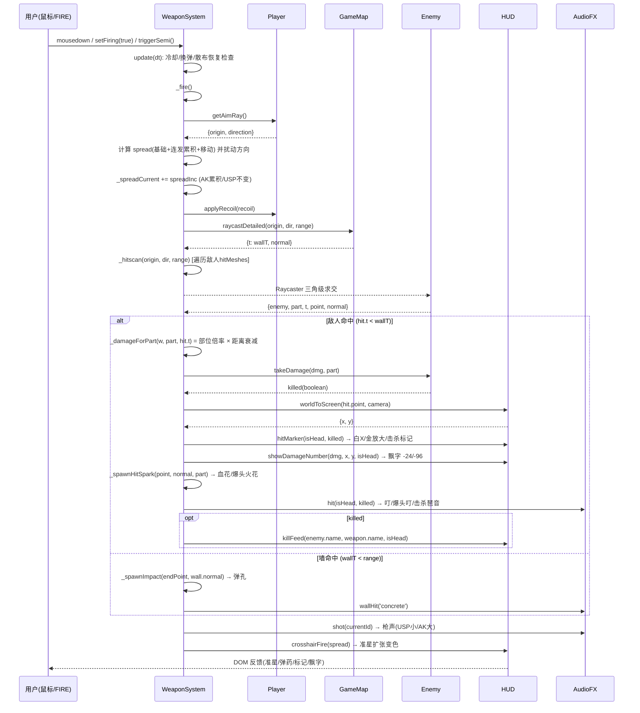

# 架构设计：高精度武器系统增量（cs15）

> **历史方案说明（2026-08-15）**：本文是旧的武器增量架构方案，部分范围、武器数量、文件行号和实现步骤已被当前代码取代。当前实现保留其数据驱动、真实网格命中和离线经典脚本约束，但当前事实以 `README.md`、`PRD.md`、源码和当前审核候选包为准。

| 项目信息 | 内容 |
| --- | --- |
| 项目 | cs15（CS 1.5 浏览器 FPS 游戏） |
| 技术栈 | Three.js（UMD 经典脚本，非 ES Module）+ 原生 JS + DOM HUD |
| 设计人 | 架构师 高见远（Bob） |
| 上游输入 | `deliverables/prd-weapon-system.md`（v1.0）+ 用户已拍板决策 + `deliverables/inspection-report.md` |
| 设计类型 | 增量架构设计（P0 实现 + P1 方案） |

**用户已拍板决策（约束条件）**：
- ❌ 不做穿墙子弹（F9/F10 剔除出范围，保持墙全挡）
- ✅ 加入伤害数字飘字（N4 升级为 P0）
- ✅ 聚焦 USP + AK 两把武器深度打磨（不加第三把）
- ✅ 数值按 CS 原版校准（AK 爆头 120 秒杀 100hp；USP 爆头 96 差 4 不秒杀）

---

## 1. 实现方案

### 1.1 整体思路

以 **config.js 数据驱动 + WeaponSystem 逻辑中枢 + HUD 视觉层 + AudioFX 听觉层** 四层架构推进，保持现有"经典脚本 + window 全局"约定，不引入打包器/ES Module。

```
┌─────────────────────────────────────────────────────────┐
│ config.js  武器手感参数表（唯一数据源，含新增字段）          │
└─────────────────────────────────────────────────────────┘
        │ 读取
        ▼
┌─────────────────────────────────────────────────────────┐
│ weapon.js  WeaponSystem（逻辑中枢）                        │
│  射击管道 / 伤害计算(部位×距离) / 换弹 / 切枪动画状态机       │
│  连发散布 / 后坐力驱动 / 命中事件派发                        │
└───────────────┬─────────────────────┬────────────────────┘
                │ 调用（职责单向）        │ 调用（职责单向）
                ▼                       ▼
┌──────────────────────────┐  ┌──────────────────────────┐
│ hud.js    HUD（视觉层）     │  │ audio.js  AudioFX（听觉层）│
│ 准星/弹药告警/命中标记/飘字   │  │ 枪声/换弹/空仓/切枪/击杀音  │
│ killFeed/小地图             │  │ 墙击音/分段换弹音           │
└──────────────────────────┘  └──────────────────────────┘
```

**核心设计决策**：

1. **伤害计算管道化**：`_fire()` → `_hitscan()` 得到 `hit{enemy, part, t, point, normal}` → `_damageForPart(w, part, hit.t)`（部位倍率 × 距离衰减）→ `enemy.takeDamage(dmg, part)`。距离衰减只影响伤害数值，不影响命中判定与弹孔。
2. **反馈事件单向派发**：命中后 WeaponSystem 依次调用 `hud.hitMarker(...)`（视觉）、`hud.showDamageNumber(...)`（飘字）、`audio.hit(...)`（音效）。**修复 H-7**：音效调用从 `hud.hitMarker` 内部移出，统一由 WeaponSystem 发起。
3. **切枪动画状态机**：WeaponSystem 新增 `_switchAnim`（0→1 进度），`update()` 推进，`_updateViewModel()` 按阶段应用"下放→上抬"位移/旋转；时长与 `fireCooldown` 均读 config `switchTime`。
4. **连发散布状态**：WeaponSystem 维护 `_spreadCurrent`（基础散布 + 连发累积 - 时间恢复），`_fire()` 与 `update()` 更新，弹道方向与 HUD 准星 gap 使用同一值（修复"准星与散布不一致"）。
5. **后坐力数据驱动**：`recoil` 扩展 `recover`（恢复速率）字段，player 恢复逻辑从硬编码 `0.06` 改为读取当前武器值（修复 H-6）；P1 后坐力模式（heavy/light）由 `recoilPattern` 区分。
6. **换弹分段动画 + 分段音**：换弹进度按 `t = 1 - reloadTimer/reloadTime` 拆 4 段（下倾→抽匣→插匣→复位），`_reloadPhase` 状态在段边界触发 `audio.reloadPhase(phase)`（修复 D1/M-3/M-4）。
7. **命中标记独立元素**：新增 `#hitmarker` DOM（X 形），按 普通命中(白)/爆头(金放大)/击杀(更大更久) 分级，CSS 动画控制时长（修复 M-1）。
8. **弹药告警状态机**：`updateWeapon` 按 `mag/magSize` 计算 `normal/low/empty` 三态，切换 CSS class（修复 D5/D2 视觉部分）。
9. **伤害飘字 DOM 池**：HUD 维护 10 个 `#damageNumbers` 池元素，`showDamageNumber(amount, screenPos, isHead)` 从武器命中点（世界坐标 → 屏幕坐标）触发，向上飘动 600ms 淡出。
10. **枪模按武器参数化**：`_buildViewModel` 重构为 `_buildGunMesh(id)`，USP/AK 独立几何（长度/护木/弹匣/枪口火光参数），切换时显隐（P1 S5）。

### 1.2 模块职责边界（修复后的单向依赖）

| 模块 | 职责 | 禁止 |
| --- | --- | --- |
| config.js | 数据定义、clamp/lerp 工具 | 不触 DOM、不触 THREE |
| weapon.js | 射击/换弹/切枪/散布/后坐/伤害/命中判定、调用 hud.* 与 audio.* | 不直接改 DOM、不合成音效 |
| hud.js | 全部 DOM 渲染与动画（准星/弹药/标记/飘字/killFeed/toast） | 不触发音效（audio 只在极少数场景如 damageFlash 保留，见待明确） |
| audio.js | 程序化音效合成 | 不触 DOM |
| player.js | 移动/视角/受击/后坐力应用（接收 recoilDef + pattern） | 不调武器系统 |
| main.js | 装配、回合流程、主循环 | 不实现武器逻辑 |

---

## 2. 文件列表（改动清单）

| 文件 | 改动类型 | 改动点概述 |
| --- | --- | --- |
| `config.js` | 修改 | 每把武器新增：`falloffStart/falloffEnd/falloffMin`、`spreadInc/spreadMax/spreadDecay`、`recoil.recover`、`recoilPattern`、`switchTime`、`muzzleScale/muzzleColor`、`reloadPhases`（可选）；保留旧 `spread` 作为 `spreadBase` 兼容名 |
| `weapon.js` | 修改（核心） | ①`startReload` 接入 `audio.reload()`；②空仓分支加 `audio.dryFire()` + `hud.setAmmoWarning('empty')`；③实现切枪动画状态机（`_switchAnim`/`_updateSwitchAnim`）；④`_damageForPart(w, part, dist)` 增加距离衰减；⑤新增 `_spreadCurrent` 连发散布；⑥`_fire` 命中分支调用增强 HUD 方法与 audio.hit(head,killed)；⑦`_buildViewModel` 重构为参数化独立枪模；⑧换弹分段动画与 `_reloadPhase`；⑨修 `_semiPending` 残留与 `triggerSemi` 条件 |
| `hud.js` | 修改（核心） | ①实现 `crosshairFire(spread)`（D3）；②`updateWeapon` 低弹量告警（D5）；③`hitMarker(part, killed)` 增强（F1-F3）；④新增 `showDamageNumber(amount, x, y, isHead)` 飘字；⑤`killFeed(name, weaponName, headshot)` 增强（F3）；⑥新增 `worldToScreen(point, camera)` 工具；⑦新增 `setAmmoWarning(mode)` |
| `audio.js` | 修改 | ①新增 `dryFire()` 空仓音；②新增 `switch(weaponId)` 切枪音；③新增 `wallHit(type)` 墙击音；④`hit(head, killed)` 增加击杀音；⑤`reload()` 扩展 `reloadPhase(phase)` 分段音；⑥（可选）shot 节流 |
| `player.js` | 修改（小） | `applyRecoil(recoilDef)`：从 `recoilDef.recover` 读取恢复速率（默认 0.06），支持 `recoilPattern` 影响左右摆动幅度 |
| `main.js` | 修改（极小） | ①击杀统计从 killFeed 猴子补丁改为显式回调注入（可选）；②装配传参（如需传 camera 给 HUD 飘字投影）；③玩家死亡判定提前（L-4） |
| `index.html` | 修改 | ①`ammoReserve` 36→60（D4）；②新增 `#hitmarker`（命中标记 X）；③新增 `#damageNumbers`（飘字容器）；④（可选）`#ammo` 加 class 挂点 |
| `style.css` | 修改 | 新增：命中标记样式（白/金/击杀）、弹药告警（low 黄 / empty 红闪 + RELOAD 提示）、飘字动画（上浮淡出）、准星 firing 扩张过渡、切枪过渡预留 |

---

## 3. 数据结构和接口

### 3.1 config.js 新增/修改字段（数据驱动核心）

```js
weapons: {
  usp: {
    // ... 现有字段（damage/headMult/fireRate/magSize/reserve/reloadTime/spread/spreadMove/recoil/range/autoReload）
    // 新增 —— 伤害衰减（P0 F7）
    falloffStart: 10,        // 米：该距离内满伤
    falloffEnd: 50,          // 米：衰减至最低倍率的距离
    falloffMin: 0.5,         // 远距离最低伤害倍率（50%）
    // 新增 —— 连发散布（P1 S1）：USP 无累积
    spreadInc: 0.0,          // 每发散布增量（rad）
    spreadMax: 0.012,        // 散布上限（= 原 spread + 少量）
    spreadDecay: 0.0,        // 散布恢复速率（rad/s）
    // 新增 —— 后坐力（P1 S2 / 修复 H-6）
    recoil: { x: 0.012, y: 0.018, recover: 0.12 },  // recover: 视角回正速率 rad/s
    recoilPattern: 'light',  // light: 轻微上抬，左右摆动小
    // 新增 —— 切枪/枪模
    switchTime: 0.3,         // 切枪动画+冷却时长（秒）
    muzzleScale: 1.0,
    muzzleColor: 0xffcc44,
  },
  ak47: {
    // ... 现有字段
    falloffStart: 10, falloffEnd: 50, falloffMin: 0.5,
    spreadInc: 0.004,        // 每发累积 0.004 rad（连发约 8 发到上限）
    spreadMax: 0.045,
    spreadDecay: 0.06,       // 停止射击后快速恢复
    recoil: { x: 0.020, y: 0.028, recover: 0.05 },  // 慢恢复 → 需压枪
    recoilPattern: 'heavy',  // heavy: 竖向上扬为主 + 随机左右摆
    switchTime: 0.3,
    muzzleScale: 1.6,
    muzzleColor: 0xffaa22,
  },
}
```

> 兼容说明：现有 `spread` 字段保留作为"基础静止散布"（等同 `spreadBase`），`_fire` 计算实际散布时使用 `spreadCurrent + spreadMove*moveFactor`，避免大改调用点。

### 3.2 类图（Mermaid classDiagram）

```mermaid
classDiagram
    class WeaponSystem {
        +scene
        +camera
        +player
        +map
        +enemies
        +hud
        +audio
        +currentId
        +state {id, mag, reserve}
        +firing
        +fireCooldown
        +reloadTimer
        +switching
        +_switchAnim
        +_spreadCurrent
        +_reloadPhase
        +_viewModels {usp, ak47}
        +_tracers
        +_impacts
        +_hitSparks
        +raycaster
        +_freshState(id)
        +setFiring(v)
        +triggerSemi()
        +switchTo(id)
        +startReload()
        +_finishReload()
        +update(dt)
        +_fire()
        +_hitscan(origin, dir, range) hit
        +_damageForPart(w, part, dist) int
        +_updateViewModel(dt)
        +_updateSwitchAnim(dt)
        +_buildGunMesh(id) Group
        +_spawnTracer(from, to)
        +_spawnImpact(point, normal)
        +_spawnHitSpark(point, normal, part)
        +_spawnMuzzleFlash()
        +reset()
        +dispose()
    }

    class HUD {
        +el
        +crosshair
        +ammoMag
        +ammoReserve
        +weaponSlots
        +killFeedEl
        +toastEl
        +audio
        +_hitmarkerEl
        +_dmgPool
        +updateVitals(hp, armor)
        +updateWeapon(w, state)
        +updateScore(enemiesLeft, kills, wave)
        +crosshairFire(spread)
        +setCrosshairSpread(rad)
        +hitMarker(part, killed)
        +killFeed(name, weaponName, headshot)
        +showDamageNumber(amount, x, y, isHead)
        +setAmmoWarning(mode)
        +worldToScreen(point, camera) Vector2
        +toast(msg, kind)
        +damageFlash()
        +drawMinimap()
    }

    class AudioFX {
        +ctx
        +master
        +enabled
        +init()
        +shot(weaponId)
        +dryFire()
        +reloadPhase(phase)
        +switch(weaponId)
        +hit(head, killed)
        +wallHit(type)
        +enemyShot()
        +hurt()
        +heal()
        +wave(n)
        +win()
        +lose()
    }

    class Player {
        +position
        +velocity
        +yaw
        +pitch
        +health
        +armor
        +alive
        +recoilOffset
        +applyRecoil(recoilDef)
        +takeDamage(amount)
        +getAimRay() {origin, direction}
        +update(dt)
    }

    class Enemy {
        +mesh
        +hitMeshes[]
        +alive
        +health
        +name
        +takeDamage(amount, part) bool
        +update(dt)
    }

    class GameMap {
        +boxes[]
        +collide(x, z, radius)
        +raycast(origin, dir, maxDist)
        +raycastDetailed(origin, dir, maxDist) {t, normal}
    }

    WeaponSystem --> HUD : 调用视觉方法
    WeaponSystem --> AudioFX : 调用音效方法
    WeaponSystem --> Player : getAimRay / applyRecoil
    WeaponSystem --> GameMap : raycastDetailed
    WeaponSystem --> Enemy : takeDamage
    HUD --> AudioFX : （仅保留 damageFlash/hurt 场景，可选）
    Enemy --> Player : takeDamage
    Enemy --> GameMap : collide / raycast
```

### 3.3 关键方法签名（伪代码）

```js
// weapon.js —— 伤害计算（部位倍率 × 距离衰减）
_damageForPart(w, part, dist) {
  let dmg;
  switch (part) {
    case 'head': dmg = w.damage * w.headMult; break;
    case 'leg':  dmg = w.damage * w.legMult; break;
    case 'arm':  dmg = w.damage * (w.armMult ?? 1); break;
    case 'gun':  dmg = w.damage * (w.gunMult ?? 0.5); break;
    default:     dmg = w.damage;
  }
  return Math.round(dmg * falloffFactor(w, dist));
}

// 距离衰减：<= falloffStart 满伤；>= falloffEnd falloffMin；中间线性
function falloffFactor(w, dist) {
  if (dist <= w.falloffStart) return 1;
  if (dist >= w.falloffEnd) return w.falloffMin;
  const t = (dist - w.falloffStart) / (w.falloffEnd - w.falloffStart);
  return 1 - (1 - w.falloffMin) * t;
}

// weapon.js —— 连发散布累积（P1 S1）
_fire() {
  // 开火前先累积
  this._spreadCurrent = Math.min(
    (this._spreadCurrent || w.spread) + w.spreadInc,
    w.spreadMax
  );
  const hSpeed = Math.hypot(this.player.velocity.x, this.player.velocity.z);
  const moveFactor = Math.min(1, hSpeed / CONFIG.player.walkSpeed);
  const spread = this._spreadCurrent + w.spreadMove * moveFactor;
  // ... 弹道方向使用 spread；HUD 使用同一 spread 值
}
update(dt) {
  // 恢复
  this._spreadCurrent = Math.max(
    w.spread,
    (this._spreadCurrent || w.spread) - w.spreadDecay * dt
  );
  // 射击冷却结束后才允许恢复（可选：停止射击 0.3s 后才恢复，更 CS）
}

// weapon.js —— 切枪动画状态机（P0 F5/F6）
switchTo(id) {
  if (id === this.currentId || !CONFIG.weapons[id]) return;
  this._semiPending = false;                 // 修 H-10
  this._stash[this.currentId] = { ...this.state };
  this.currentId = id;
  this.state = this._stash[id] ? { ...this._stash[id] } : this._freshState(id);
  this.reloadTimer = 0;                       // 换弹被打断（可选：若 >0 提示）
  const w = CONFIG.weapons[id];
  this.fireCooldown = w.switchTime;           // 冷却 = 动画时长
  this._switchAnim = 0;                       // 启动下放→上抬动画
  this._switching = true;
  this.firing = false;
  this.audio.switch(id);                      // 切枪音（P0 F6）
  this.hud.updateWeapon(w, this.state);
  this.hud.toast(w.name);
}
_updateSwitchAnim(dt) {
  if (!this._switching) return;
  const w = CONFIG.weapons[this.currentId];
  this._switchAnim += dt / w.switchTime;
  if (this._switchAnim >= 1) { this._switching = false; this._switchAnim = 1; }
  // 下放段 (0-0.5)：y 下降 + 前倾；上抬段 (0.5-1)：回位 + 轻微过冲
  const t = this._switchAnim;
  const down = t < 0.5 ? t / 0.5 : 1 - (t - 0.5) / 0.5;   // 0→1→0
  this._viewGroup.position.y = baseY - down * 0.35;
  this._viewGroup.rotation.x = baseRotX - down * 0.6;
}

// weapon.js —— 换弹分段（P1 S6）+ 分段音
update(dt) {
  if (this.reloadTimer > 0) {
    const prevPhase = this._reloadPhase;
    this.reloadTimer -= dt;
    const t = 1 - this.reloadTimer / w.reloadTime;   // 0→1
    const phase = t < 0.3 ? 1 : t < 0.6 ? 2 : t < 0.8 ? 3 : 4; // 下倾/抽匣/插匣/复位
    if (phase !== prevPhase) {
      this._reloadPhase = phase;
      this.audio.reloadPhase(phase);   // 阶段边界触发分段音（D1 接入）
    }
    if (this.reloadTimer <= 0) this._finishReload();
  }
}

// weapon.js —— 射击命中反馈（P0 F1-F4 + 飘字）
_fire() {
  // ... 命中分支（替换原 L211-220）
  if (hit && hit.t < wall.t) {
    const dist = hit.t;
    const dmg = this._damageForPart(w, hit.part, dist);
    const killed = hit.enemy.takeDamage(dmg, hit.part);
    const screenPos = this.hud.worldToScreen(hit.point, this.camera);
    this.hud.hitMarker(hit.part === 'head', killed);
    this.hud.showDamageNumber(dmg, screenPos.x, screenPos.y, hit.part === 'head');
    this._spawnHitSpark(hit.point, hit.normal, hit.part);
    this.audio.hit(hit.part === 'head', killed);      // 修复 H-7：音效由 weapon 发起
    if (killed) {
      this.hud.killFeed(hit.enemy.name, w.name, hit.part === 'head');
      if (this.onKill) this.onKill();                  // 替代 main.js 猴子补丁（可选）
    }
  } else if (wall.t < w.range) {
    this._spawnImpact(endPoint, wall.normal || dir.clone().negate());
    this.audio.wallHit('concrete');                    // 墙击音（P1 S4）
  }
  this.audio.shot(this.currentId);
  this.player.applyRecoil(w.recoil);                   // recover/pattern 在 player 内读取
  this.hud.crosshairFire(this._spreadCurrent + w.spreadMove * moveFactor);  // D3 修复
}

// hud.js —— 命中标记（F1-F3）
hitMarker(head, killed) {
  const el = this._hitmarkerEl;
  el.classList.remove('show', 'head', 'kill');
  void el.offsetWidth;                 // 强制 reflow 重启动画
  if (killed)      el.classList.add('show', 'kill');
  else if (head)   el.classList.add('show', 'head');
  else             el.classList.add('show');
}

// hud.js —— 弹药告警（D5/D2）
updateWeapon(w, state) {
  this.weaponName.textContent = w.name;
  this.ammoMag.textContent = state.mag;
  this.ammoReserve.textContent = state.reserve;
  const ratio = w.magSize > 0 ? state.mag / w.magSize : 0;
  this.ammoMag.classList.toggle('ammo-low',  ratio > 0 && ratio <= 0.25);
  this.ammoMag.classList.toggle('ammo-empty', ratio <= 0);
  // weaponSlots 高亮 ...
}

// hud.js —— 伤害飘字（用户确认 P0）
showDamageNumber(amount, x, y, isHead) {
  let el = this._dmgPool.pop();
  if (!el) return;
  el.textContent = `-${Math.ceil(amount)}`;
  el.className = isHead ? 'dmg-num head' : 'dmg-num';
  el.style.left = x + 'px';
  el.style.top = y + 'px';
  el.classList.add('show');
  this._dmgActive.push(el);
  setTimeout(() => { el.classList.remove('show'); this._dmgPool.push(el); }, 650);
}
worldToScreen(point, camera) {
  const v = point.clone().project(camera);
  return {
    x: (v.x * 0.5 + 0.5) * window.innerWidth,
    y: (-v.y * 0.5 + 0.5) * window.innerHeight,
  };
}

// audio.js —— 新增音效签名
dryFire()          // 空仓咔嗒（短促低频方波）
switch(weaponId)   // 切枪抽拉音（USP 轻 / AK 重）
wallHit(type)      // 墙击音（concrete 闷 / wood 脆，可选区分）
hit(head, killed)  // 原 hit(head) 扩展：killed 时叠加击杀琶音
reloadPhase(phase) // phase: 1下倾 2抽匣 3插匣 4复位，各阶段不同频率咔哒

// player.js —— 后坐力应用（修复 H-6）
applyRecoil(recoilDef) {
  this.pitch -= recoilDef.x;                          // 上抬
  this.recoilOffset += recoilDef.x;
  const sway = recoilDef.pattern === 'heavy' ? 1.6 : 1.0;  // AK 左右摆动更明显
  this.yaw += (Math.random() - 0.5) * 2 * recoilDef.y * sway;
  this.recoilRecover = recoilDef.recover ?? 0.06;     // 存本次恢复速率
  this.pitch = clamp(this.pitch, -Math.PI / 2 + 0.01, Math.PI / 2 - 0.01);
}
// update() 内恢复段（L192-197 改为）
if (this.recoilOffset > 0) {
  const recover = Math.min(this.recoilOffset, dt * (this.recoilRecover || 0.06));
  this.recoilOffset -= recover;
  this.pitch += recover;
}
```

---

## 4. 程序调用流程

### 4.1 射击 → 命中 → 飘字 → 音效（P0 主链路，Mermaid sequenceDiagram）



### 4.2 换弹 / 切枪流程

```mermaid
sequenceDiagram
    participant U as 用户
    participant W as WeaponSystem
    participant A as AudioFX
    participant H as HUD

    Note over U,W: 换弹(R)
    U->>W: startReload()
    W->>W: 校验(reloadTimer<=0 && mag<magSize && reserve>0)
    W->>A: reloadPhase(1) 下倾咔哒
    W->>H: toast('换弹中…')
    loop update(dt)
        W->>W: reloadTimer -= dt; 计算 phase
        alt phase 变化
            W->>A: reloadPhase(phase) (2抽匣/3插匣/4复位)
        end
        W->>W: _updateViewModel(dt) 分段下倾动画
    end
    W->>W: _finishReload() 弹药补充
    W->>H: updateWeapon(w, state)

    Note over U,W: 切枪(1/2)
    U->>W: switchTo(id)
    W->>W: _semiPending=false; stash 当前弹药; reloadTimer=0
    W->>A: switch(id) 抽枪音
    W->>H: updateWeapon + toast(武器名)
    loop update(dt)
        W->>W: _switchAnim 0→1 下放→上抬
    end
    W->>W: fireCooldown = switchTime; _switching=false
```

---

## 5. 任务列表（工程师实现顺序，按依赖排序）

> 约定：所有任务均为**经典脚本**，无打包；每任务完成后 `node --check` 语法自检 + 浏览器手测清单。

### T01 配置与骨架层（数据驱动地基）
- **优先级**：P0　**依赖**：无
- **改动文件**：`config.js`、`index.html`、`style.css`
- **内容**：
  1. `config.js`：每武器新增 falloff / spreadInc+spreadMax+spreadDecay / recoil.recover / recoilPattern / switchTime / muzzleScale / muzzleColor（见 §3.1）
  2. `index.html`：L70 `ammoReserve` 36→60（D4）；新增 `#hitmarker`（X 形标记容器，含 4 条线 span 或伪元素）；新增 `#damageNumbers` 飘字容器
  3. `style.css`：新增 `#hitmarker` 三态样式（`.show` 白 / `.head` 金放大 1.4x / `.kill` 更大更久）；弹药告警 `.ammo-low`（黄）/ `.ammo-empty`（红闪烁 + 可配 RELOAD 伪元素）；飘字 `.dmg-num`（上浮 600ms 淡出，`.head` 金色大号）；准星 `#crosshair.fire` 过渡类（供 crosshairFire）
- **验收**：页面加载无报错；初始弹药显示 12/60；命中标记/飘字元素存在但不可见。

### T02 HUD 视觉层（命中反馈 + 弹药告警 + 飘字）
- **优先级**：P0　**依赖**：T01
- **改动文件**：`hud.js`、`style.css`、`index.html`（如需微调）
- **内容**：
  1. `hud.js` `crosshairFire(spread)`：实现 D3 —— 设置 `--gap` 临时扩张（如 `+30%`）+ 加 `fire` class 80ms 后恢复（用内部 `_fireFlashTimer`，注意与 `setCrosshairSpread` 脏检查协调：扩张期间暂停脏检查或记录基础值）
  2. `hud.js` `updateWeapon(w, state)`：弹药告警三态（normal/low/empty）切换 class（D5）
  3. `hud.js` `hitMarker(head, killed)`：重写为 `#hitmarker` 三态显示（F1-F3）；移除旧的 `crosshair.classList.add('firing')` 逻辑与 `audio.hit` 调用（音效移交 weapon）
  4. `hud.js` 新增 `worldToScreen(point, camera)`、`showDamageNumber(amount, x, y, isHead)`（DOM 池 10 个，650ms 淡出回收）
  5. `hud.js` `killFeed(name, weaponName, headshot)`：显示武器名/爆头标识（F3），如 "你 ✕ Viper【AK-47 爆头】"
  6. `hud.js` `setAmmoWarning(mode)`：供 weapon 空仓时触发红色告警（D2 视觉侧）
- **验收**：命中敌人出现白色 X；爆头金色放大；击杀更醒目；弹药 ≤25% 变黄、=0 红色闪烁；射击准星扩张变色；飘字 -24/-96 正确显示。

### T03 武器核心逻辑（P0 缺陷修复 + 伤害衰减 + 切枪动画）
- **优先级**：P0　**依赖**：T01、T02
- **改动文件**：`weapon.js`、`player.js`、`config.js`（如需微调）
- **内容**：
  1. `weapon.js` `startReload()`：接入 `audio.reload()`/`reloadPhase(1)`（D1）；空仓分支（L160-167）加 `audio.dryFire()` + `hud.setAmmoWarning('empty')` + 备弹为 0 差异化 toast（D2/H-9 相关）
  2. `weapon.js` `switchTo()`：清 `_semiPending`（H-10）、`reloadTimer=0` 时提示换弹取消、`audio.switch(id)`（F6）、设置 `_switchAnim`（F5）
  3. `weapon.js` 新增 `_updateSwitchAnim(dt)` + `_updateViewModel` 集成下放→上抬动画（F5）
  4. `weapon.js` `_damageForPart(w, part, dist)`：增加 `falloffFactor` 距离衰减（F7），`_fire()` 传 `hit.t`（F8）
  5. `weapon.js` `_fire()` 命中分支：调用 `hud.hitMarker(head, killed)`、`hud.showDamageNumber(...)`、`audio.hit(head, killed)`、`killFeed(name, weaponName, headshot)`；墙命中加 `audio.wallHit`（F4/S4）
  6. `weapon.js` `_semiPending` 逻辑：`triggerSemi()` 增加冷却/换弹/切枪中忽略；`_fire()` 弹道使用 `_spreadCurrent`（S1 基础）
  7. `player.js` `applyRecoil`：读 `recoil.recover` + `recoilPattern`（H-6 修复 + S2 基础）
- **验收**：换弹有音效；空仓有咔嗒+红字；切枪有下放/上抬动画+抽枪音；10m 内满伤、50m 衰减 50%（可用 console/临时 HUD 验证）；爆头/躯干/击杀音效可区分；飘字与音效同步。

### T04 武器差异化与手感调优（P1）
- **优先级**：P1　**依赖**：T03
- **改动文件**：`weapon.js`、`audio.js`、`config.js`、`style.css`（枪模参数微调）
- **内容**：
  1. `weapon.js` 连发散布累积/恢复：`_spreadCurrent` 在 `_fire()` 累积（AK 0.004/发 → 上限 0.045）、`update()` 恢复（AK 0.06/s；USP 不累积）；HUD `setCrosshairSpread` 使用累积值（S1）
  2. `weapon.js` `_buildViewModel` 重构为 `_buildGunMesh(id)`：USP 短管无弹匣小火光（黄）、AK 长管+木护木+弯弹匣+大火光（橙红），`_muzzleFlash` 参数化（S5）
  3. `weapon.js` 换弹分段：`_reloadPhase` 状态机 + `_updateViewModel` 四段动画（下倾→抽匣→插匣→复位），修 M-4 完成跳动（S6）
  4. `audio.js`：`reloadPhase(phase)` 分段音、`switch(id)`、`dryFire()`、`wallHit(type)`、`hit(head, killed)` 击杀音（S4/F4）
  5. `config.js`：微调手感参数（fireRate 保持 0.099/0.16 确认 CS 校准 S3；recover 速率调优）
  6. `style.css`：枪模相关（无 DOM 样式变化，主要是 Three 内材质）
- **验收**：AK 连发准星逐渐张开、停止快速收回；AK 压枪手感与 USP 明显不同；两把枪第一人称外观差异明显；换弹动作分 4 段且音效同步；AK 爆头 120 秒杀、USP 爆头 96 不秒杀（100hp 敌人）。

### T05 集成、回归与收尾
- **优先级**：P0（发布门槛）　**依赖**：T04
- **改动文件**：`main.js`、`index.html`、`weapon.js`（只读核对/微调）、`hud.js`
- **内容**：
  1. `main.js`：击杀统计从 `HUD.prototype.killFeed` 猴子补丁改为显式回调（`weapons.onKill = ...`），删 L460-464 补丁（M-2 可维护性）；玩家死亡判定提前到波次判定之前（L-4）
  2. `main.js`：装配核对 —— `WeaponSystem` 构造传参齐全；飘字容器初始化；HUD `audio` 注入核对
  3. 一致性回归：index.html 静态数值 vs config；脚本加载顺序；`node --check` 全部 js 通过
  4. 手测清单：PC（鼠标+R+1/2+连发+爆头+远距离）+ 移动端（FIRE 按钮+切枪按钮+换弹按钮+飘字显示）
- **验收**：全流程无回归；击杀统计正确；两平台操作正常；无 console 报错。

---

## 6. 依赖与共享知识（跨文件约定）

1. **反馈调用单向性**：WeaponSystem 是唯一调用方 —— `hud.hitMarker/hitMarker/killFeed/showDamageNumber/setAmmoWarning/crosshairFire` 与 `audio.shot/dryFire/reloadPhase/switch/hit/wallHit` 全部由 weapon.js 调用；**hud.js 不再触发命中音效**（H-7 修复后）。唯一保留：`hud.damageFlash()` 内 `audio.hurt()`（玩家受击，非武器链路）。
2. **config 字段命名**：
   - 衰减：`falloffStart` / `falloffEnd` / `falloffMin`（单位米，倍率）
   - 散布：`spread`（基础/静止，兼容旧字段）`spreadInc`（每发增量）`spreadMax`（上限）`spreadDecay`（恢复 rad/s）`spreadMove`（移动加成）
   - 后坐力：`recoil.{x, y, recover}`、`recoilPattern: 'light'|'heavy'`
   - 切枪：`switchTime`（动画+冷却共用）
   - 枪模：`muzzleScale` / `muzzleColor`
3. **伤害计算唯一入口**：`_damageForPart(w, part, dist)`，任何人不得在外部重复计算伤害；衰减函数 `falloffFactor(w, dist)` 为模块内工具（可放 weapon.js 顶部）。
4. **经典脚本全局暴露**：新增函数/类继续 `window.X = X`；`index.html` script 顺序不可变（config → three → map → player → enemy → weapon → hud → audio → pickup → main）。
5. **HUD 新增方法命名**（小驼峰、动词开头）：`crosshairFire(spread)`、`hitMarker(head, killed)`、`killFeed(name, weaponName, headshot)`、`showDamageNumber(amount, x, y, isHead)`、`setAmmoWarning(mode)`、`worldToScreen(point, camera)`。
6. **CSS class 约定**：弹药三态 `ammo-low`（黄）/`ammo-empty`（红闪）；命中标记 `#hitmarker.show/.head/.kill`；飘字 `.dmg-num`（+`.head`）；准星 `#crosshair.fire`。
7. **飘字数值**：显示 `Math.ceil(dmg)`，爆头金色 1.4x 字号，普通白色；650ms 上浮淡出；DOM 池 10 个。
8. **音效不阻塞**：所有 audio 方法 `if (!this.ctx) return;` 保持现状；新增方法同样遵循。
9. **AK 爆头校准**：damage 30 × headMult 4 = 120（10m 内满伤秒杀 100hp）；USP 24 × 4 = 96（差 4 不秒杀）。任何后续调参不得破坏该基准（除非 PRD 变更）。
10. **数据一致性**：index.html 静态数值只作占位，运行时一律由 `hud.updateWeapon/updateVitals` 覆盖；静态值必须与 config 一致（D4 后 60）。

---

## 7. 待明确事项

| # | 事项 | 当前假设 | 影响 |
| --- | --- | --- | --- |
| Q1 | 距离衰减曲线 | 线性（10m 满伤 → 50m 50%）；如需非线性（如 CS 的 pow 曲线）可加 `falloffCurve` 字段 | 手感微调 |
| Q2 | 连发散布恢复时机 | 射击冷却结束后立即按 `spreadDecay` 恢复；CS 原版是停止射击约 0.3-0.5s 后才恢复（更真实） | AK 压枪节奏 |
| Q3 | AK 首发是否上扬惩罚 | 暂不加（recoil 恒定每发）；CS 中首发散布更准 | 首发手感 |
| Q4 | 飘字范围 | 所有命中（含爆头）都显示；爆头金色放大。是否也显示对玩家伤害（敌打我）？ | 暂只显示玩家打敌人 |
| Q5 | 换弹分段音粒度 | 4 段（下倾/抽匣/插匣/复位）；如需"空仓换弹"额外 1 段（甩空匣）可扩展 | 音效细节 |
| Q6 | 墙击音材质区分 | 暂统一 'concrete'；地图墙体暂不区分木/混凝土（需 map.js 给 box 加 materialType 标记，改动面大，建议 P2） | S4 完成度 |
| Q7 | 独立枪模精细度 | 用参数化几何盒子组合（USP 短管/AK 长管+木护木+弯弹匣），不引入外部模型文件 | S5 视觉上限 |
| Q8 | `hud.damageFlash` 内 `audio.hurt` 保留 | 保留（玩家受击链路非武器链路）；若希望 HUD 完全不触 audio，可让 player 持 audio 引用后迁移 | 职责纯度 |
| Q9 | 移动端切枪按钮与动画 | 与 PC 一致（切枪动画 + 冷却 + 音效都走 switchTo 统一路径） | 无分叉 |
| Q10 | main.js `_onKill` 显式回调改造 | 建议在 T05 做；若时间紧可保留猴子补丁（功能等价） | 可维护性 |

---

*架构设计完毕。配套文件：`deliverables/inspection-report.md`（检查报告）、`deliverables/class-diagram.mermaid`、`deliverables/sequence-diagram.mermaid`。*
