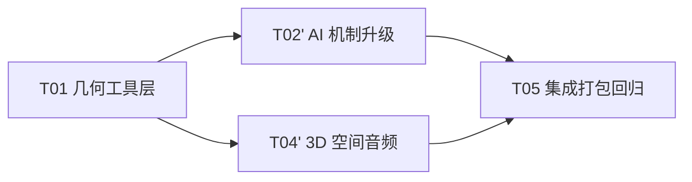
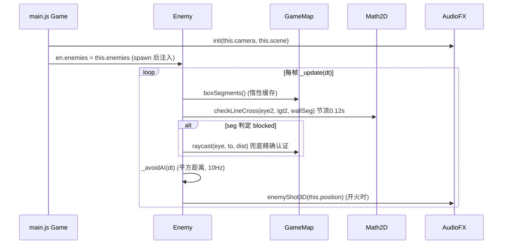

# CS 1.5 × three-cs 融合架构方案 v1.1（最终实施规格）

> 版本：v1.1 ｜ 作者：架构师（高见远） ｜ 状态：**已确认，可实施**
> v1.1 变更：用户对 §8 全部拍板 → 融合范围锁定为 **P0 三件 + P2 音频**；砍 L1-2 环绕走位、L2-1 GLB（及全部 L3）。
> 本文档含「给工程师的精确实施规格」（§10），可据此直接编码。

> **历史快照标记（2026-08-21）**：本文 v1.1 的实施规格、范围判断和旧体积/文件数均保留为历史方案记录，不是当前实现基线；尤其不能把文中“L2-1 GLB/骨骼动画不做”或旧的 13 文件、约 3.06 MB 数值当作当前状态。
>
> **当前状态（2026-08-25）**：工作区当前入口实际按 `config.js → math2d.js → three.min.js → forge.js → ak47_model.js → ak47_tex.js → awp_model.js → awp_tex.js → enemy_model.js → enemy_rig.js → map.js → player.js → enemy.js → textures.js → weapon.js → hud.js → audio.js → pickup.js → main.js` 加载。当前实现已采用 24 节混合骨架和 50,008 / 17,990 / 3,999 三档敌人 LOD；Glock-18 为 `weapon.js` 程序化模型，AK/AWP 为内嵌 OBJ，模型接口是 `build(geometry, material)`，实际调用 `build(null, material)`。当前审核候选 `cs1.5-minitool-hybrid-rig-audit.zip` 为 24 文件、5,686,636 B（约 5.69 MB），SHA256 `2E8CA81EDBFCCC9607E0DDB07678F774E25467F4AAEEEE9AF66169222C67B103`；Windows PowerShell 5.1 与 `pwsh` 均确认逐字节一致。正式基线 `cs1.5-minitool.zip` 仍独立保留，真实 Android/iOS 设备尚未连接。

---

## 1. 融合目标（一句话）

> **在严守小红书小工具容器限制（经典脚本、禁联网/Worker/WASM/指针锁定、zip ≤10MB）的前提下，将 three-cs 的「2D 视线线段判定」与「点到线段 AI 防穿模」两项机制级能力融入 cs1.5 现有 PVE 波次制，并补上 PositionalAudio 3D 空间音频；其余（环绕走位/GLB 动画/联机/ESM/第三人称）一律不做。**

---

## 2. 约束总览表（小工具限制 → 对应可融合项）

| # | 容器限制（规范原文要点） | 对 three-cs 资产的影响 | 本次实施策略 |
|---|---|---|---|
| C1 | 脚本必须经典脚本：禁 `type="module"`、禁 `import`/`export` | three-cs 用 ESM + `three.module.js`，全部不可直接用 | 仅移植 Math2d.js（纯函数）→ 挂 `window.Math2D`；不引入任何 loader/GLB 资产 |
| C2 | 禁 `eval()` / `new Function()` / WebAssembly | DRACOLoader（wasm）不可用 | **本轮不引入 GLB/DRACO**（用户拍板：无 Blender 处理条件） |
| C3 | 禁网络请求（fetch / XHR / WebSocket / EventSource） | socket.io 联机不可行；GLTFLoader.load() 走 XHR 不可用 | 不做联机、不做 GLB；合规 grep 扫描兜底 |
| C4 | 禁 Worker / OffscreenCanvas / SharedArrayBuffer | three-cs 无依赖 | 无影响 |
| C5 | 禁指针锁定（pointer lock） | three-cs useplayer 的 PC 控制不可移植 | 现有触屏虚拟摇杆已覆盖；不引入 |
| C6 | 禁外部资源；仅允许指定类型；GLB 二进制不在允许列表 | — | 不引入任何外部/二进制资源；math2d.js 为纯文本 JS |
| C7 | 音视频/字体仅包内文件；data:/blob: 媒体禁 | sounds/ 的 mp3 可打包但非必须 | 现有 WebAudio 程序化合成保留；3D 音频用 PositionalAudio（无需音频文件） |
| C8 | WebGL 可用：包内/Canvas/内存对象 ✅；WASM 加速库 ❌ | 蒙皮动画可用但本轮不用 | 本轮无 WebGL 变更 |
| C9 | localStorage 可用 | — | 无影响 |
| C10 | zip ≤10MB（建议 ≤2MB）；现状 3.06MB | — | 本轮仅 +1.5~3KB（math2d.js），zip ≈3.06MB，**无压力** |
| C11 | 交互优先 Pointer Events、安全区、自适应布局 | — | 现有触屏体系不改变 |

---

## 3. 融合方案判定（v1.1 定稿）

### L1 机制级

| 子项 | three-cs 来源 | 判定 | 合规依据 | 本次动作 |
|---|---|---|---|---|
| L1-1 checkLineCross 视线轻量化 | Math2d.js `ccw()` + `checkLineCross()` | ✔️ **做** | 纯 JS 数学，无受限 API | `_canSeePlayer` 墙遮挡改用 2D 线段判定，**raycast 兜底保留，AI 行为零改动** |
| L1-2 遮挡时环绕走位 | aiplayer `planning()` | ✘ **砍**（用户拍板：仅轻量化不改行为） | — | 不做；保留现有直线追 + 横移 + 卡墙解围 |
| L1-3 点到线段防 AI-AI 穿模 | useplayer `pointToSegmentDistance` | ✔️ **做**（用户拍板保留） | 纯几何 | 新增 `_avoidAI()`：纯位置约束，不改追击/开火逻辑 |
| L1-4 环绕路径预生成 / L1-5 wise 系数 | aiplayer greatPanel / wise | ✘ 砍 | 与 L1-2 同因 | 不做 |
| L1-6 频率控制射击 | aiplayer frequency | ✘ | 现有 burst 系统更完善 | 不融合 |

### L2 表现级

| 子项 | 判定 | 本次动作 |
|---|---|---|
| L2-1 GLB 骨骼动画敌人 | ✘ **砍**（用户拍板：无 Blender 去 Draco 处理条件；且 DRACO/WASM 禁、GLB 二进制非允许类型、base64 膨胀 4/3） | 不引入 models.js / gltf-loader.js / anim.js；**若未来获得非 Draco ≤1MB 模型，可重开此路**（见 v1.0 §L2-1 四件套） |
| L2-2 PositionalAudio 3D 空间音频 | ✔️ **做** | AudioListener 挂相机 + PositionalAudio 池 + `enemyShot3D(pos)`；WebAudio 合规、0 体量 |
| L2-3 Nav 小地图移植 | ✘ | 现有 hud.drawMinimap 已超出其功能 |
| L2-4 血条/精灵 | ✘ | 现有实现已覆盖 |

### L3 架构级（全部 ✘，不做）

| 子项 | 判定 | 理由 |
|---|---|---|
| socket.io 联机 | ✘ | C3 禁 WebSocket/网络，容器纯离线单机 |
| ESM 改造 | ✘ | 现状经典脚本 13 文件已稳定上线且合规 |
| 第三人称视角 | ✘ | 与第一人称定位冲突 + C5 禁 pointerlock |

---

## 4. 最终融合范围（已确认）

| 优先级 | 项 | 说明 |
|---|---|---|
| **P0** | T01 几何工具层（math2d.js） | 基础设施，其余任务依赖 |
| **P0** | T02′ 视线轻量化（`_canSeePlayer` seg 判定） | 提性能、行为不变 |
| **P0** | T02′ AI-AI 防穿模（`_avoidAI`） | 纯观感约束 |
| **P2** | T04′ PositionalAudio 3D 音频 | 枪声方位感 |
| **P0** | T05 集成打包回归 | package.ps1 / index.html / 合规扫描 |
| **✘** | L1-2 环绕走位、L2-1 GLB、L3 全部 | 已确认不做 |

---

## 5. 实施路线与任务分解（v1.1，4 个任务）



| 任务 | 名称 | 涉及文件 | 依赖 | 难度 | 体量影响 | 风险 |
|---|---|---|---|---|---|---|
| **T01** | 几何工具层 | 新增 `math2d.js`；改 `index.html`、`config.js` | 无 | 低 | +1.5KB | 低 |
| **T02′** | AI 机制升级（仅两项） | 改 `enemy.js`、`map.js`、`config.js` | T01 | 中 | +2~4KB | 中：掩体高度过滤是行为不变的关键（见 §10.2） |
| **T04′** | 3D 空间音频 | 改 `audio.js`、`enemy.js`、`main.js` | T01 | 中 | 0 | 低-中：移动端 WebAudio 差异 |
| **T05** | 集成打包回归 | 改 `main.js`、`tools/package.ps1`、`index.html`；合规扫描 | T02′/T04′ | 低 | 0 | 中：回归面广，真机+模拟器双验证 |

---

## 6. 新增文件清单与体积评估（v1.1）

| 文件 | 内容 | 体积预估 | 是否进 package.ps1 |
|---|---|---|---|
| `math2d.js` | Math2d.js 移植（ccw/checkLineCross/pointToSegmentDistance/distance），挂 `window.Math2D` | +1.5~2KB | ✅ 必加 |
| ~~models.js / gltf-loader.js / anim.js~~ | ~~GLB 资产与 loader~~ | **已砍** | ❌ 不引入 |

**体积预算（v1.1 实测口径）**：
- 现状：3.06MB（13 文件）
- 本轮后：**~3.07MB**（+ math2d.js 1.5~2KB，PositionalAudio 为运行时对象零文件）✅ 远低于 2MB 建议值，**无压力**（用户确认体积可至 5MB，实际用不到）

**package.ps1 修改**：`$files` 数组（第 4-8 行）在 `"config.js"` 后追加 `"math2d.js"`（保持与 index.html 脚本顺序一致）。

---

## 7. 风险与缓和（v1.1）

| # | 风险 | 等级 | 缓和措施 |
|---|---|---|---|
| R1 | 指针锁定不可用 | 已处理 | 现有 isTouch 检测 + try/catch + 虚拟摇杆；本轮无 pointerlock 新增 |
| R2 | 视线判定「掩体误遮挡」导致行为变化（最大风险） | 中 | **boxSegments() 只输出 maxY ≥ 1.55 的高墙**（外墙/隔墙 wallH=5），掩体箱 h≤1.4 不参与 2D 判定——与现有 raycast 行为一致；T02′ 验收含「掩体后敌人可见性对比」 |
| R3 | seg 判定 2D 误判（线段跨越 box 角而非穿墙） | 低 | raycast 兜底：seg 判定 blocked 后**仍走一次 raycast 精确认证**（仅命中时多 1 次射线，节流 0.12s 下开销可忽略） |
| R4 | AI-AI 推开把敌人推入墙内 | 低 | `_avoidAI` 推完后做一次 `this.map.collide()` 解算（复用现有碰撞）；阈值 ≤0.9m 远离碰撞半径和 |
| R5 | 低端机性能 | 低 | seg 判定 O(墙段数)（约 15 段×4=60 段 vs 30+ AABB 3D slab），节流 0.12s 不变；AI-AI 平方距离 O(n²) n≤18 ≈ 324 次/0.1s，可忽略 |
| R6 | PositionalAudio 真机兼容（WebAudio 差异） | 低-中 | `enemyShot3D` 内部 try/catch，listener/池创建失败或不可用时**自动回退 `enemyShot()` 全局播放**；池上限 6 节点防泄漏 |
| R7 | 旋转态坐标误解 | 低 | 音频位置为**场景世界坐标**（WebGL 场景，不受 #gameRoot CSS 旋转影响），无需换算——规格明确写死 |

---

## 8. 决策记录（§8 待确认 → 已拍板）

| # | 待确认项 | 用户决策 | 对方案的影响 |
|---|---|---|---|
| 1 | GLB 模型来源（Blender 去 Draco） | **无处理条件** | L2-1 降级 ✘，删 models/gltf-loader/anim |
| 2 | 体积口径 | **可至 ~5MB**（实际 ~3.07MB，无压力） | 保留余量，不做体积压缩 |
| 3 | 视觉风格双模 | **本轮不做 GLB** | 无风格冲突问题 |
| 4 | AI 手感 | **仅轻量化不改行为** | L1-2 环绕走位砍掉；L1-1 必须行为等价 |
| 5 | 3D 音频体验 | **接受**（P2 做） | T04′ 保留 |
| 6 | 最终范围 | **P0 三件 + P2 音频** | 锁定 §4 |

---

## 9. 架构总览（类图 / 时序图）

```mermaid
classDiagram
    class Math2D {
        +ccw(a, b, c) boolean
        +checkLineCross(p1, p2, p3, p4) boolean
        +pointToSegmentDistance(p, s1, s2) number
        +distance(a, b) number
    }
    class GameMap {
        +boxes Box[]
        +collide(x, z, r) {x, z}
        +raycast(o, d, max) number
        +boxSegments() Seg[]  "新增：仅高墙(maxY>=1.55)四边，惰性缓存"
    }
    class Enemy {
        +enemies Enemy[]  "main 注入：动态数组引用"
        +_canSeePlayer() boolean  "改造：seg 判定 + raycast 兜底"
        +_avoidAI(dt)  "新增：AI-AI 纯位置约束"
        +_shootOnce(dist)  "改造：enemyShot→enemyShot3D"
    }
    class AudioFX {
        +listener AudioListener
        +_paPool PositionalAudio[]
        +init(camera, scene)
        +enemyShot3D(pos)  "新增：3D 播放，失败回退 enemyShot()"
    }
    Math2D <-- Enemy
    GameMap <-- Enemy
    AudioFX <-- Enemy
```



---

## 10. 给工程师的精确实施规格（按此编码）

> 锚点均基于当前代码实测（enemy.js / audio.js / main.js / config.js / map.js / index.html / tools/package.ps1）。改动顺序：T01 → T02′ → T04′ → T05。

### 10.1 T01 几何工具层

**新增 `math2d.js`**（放项目根，与 config.js 同级）：

```js
// math2d.js —— 2D 几何工具（three-cs Math2d.js 移植）
// 经典脚本：无 import/export，挂 window.Math2D；依赖顺序：config → math2d → three → ...
// 所有点对象约定 { x, z }（平面坐标，忽略 y）
window.Math2D = {
  // 三点逆时针测试：a→b→c 逆时针返回 true（含叉积符号）
  ccw(a, b, c) {
    return (c.x - a.x) * (b.z - a.z) - (b.x - a.x) * (c.z - a.z) > 0;
  },
  // 线段 p1p2 与 p3p4 是否相交（标准 ccw 组合判定）
  checkLineCross(p1, p2, p3, p4) {
    return Math2D.ccw(p1, p3, p4) !== Math2D.ccw(p2, p3, p4)
        && Math2D.ccw(p1, p2, p3) !== Math2D.ccw(p1, p2, p4);
  },
  // 点 p 到线段 s1s2 的最短距离（投影 + 端点钳制）
  pointToSegmentDistance(p, s1, s2) {
    const dx = s2.x - s1.x, dz = s2.z - s1.z;
    const l2 = dx * dx + dz * dz;
    if (l2 < 1e-9) return Math.hypot(p.x - s1.x, p.z - s1.z);
    let t = ((p.x - s1.x) * dx + (p.z - s1.z) * dz) / l2;
    t = Math.max(0, Math.min(1, t));
    return Math.hypot(p.x - (s1.x + t * dx), p.z - (s1.z + t * dz));
  },
  // 两点距离
  distance(a, b) { return Math.hypot(a.x - b.x, a.z - b.z); },
};
```

> 返回类型：`ccw`/`checkLineCross` → boolean；`pointToSegmentDistance`/`distance` → number。无任何依赖，可独立单测。

**改 `index.html`**（第 188 行附近 script 区）：在 `<script src="config.js"></script>` 之后、`three.min.js` 之前插入：

```html
<script src="config.js"></script>
<script src="math2d.js"></script>   <!-- 新增：enemy.js 依赖 Math2D，须在 enemy 之前 -->
<script src="three.min.js"></script>
```

**改 `config.js`**：在 `CONFIG.enemy` 块（90-110 行）**之后**新增顶层块：

```js
// ---- AI 融合（three-cs）----
ai: {
  losMode: 'seg',   // 视线判定：'seg' = 2D 线段轻量判定（raycast 兜底）；'ray' = 原 3D 射线（回退开关）
  losSegY: 1.55,    // 参与遮挡的墙体最低高度：掩体箱 maxY<此值不遮视线（维持现有 raycast 行为）
  aiSpacing: 0.9,   // AI-AI 最小间距（米），_avoidAI 阈值；< 两敌碰撞半径和(0.4+0.4)即可生效
},
```

### 10.2 T02′ AI 机制升级（仅两项，不含环绕走位）

**改 `map.js`**：在 `raycastDetailed` 方法（365-373 行）之后新增方法（`GameMap` 类内）：

```js
// 2D 墙线段（视线判定用）：仅输出"高墙"四边（maxY>=CONFIG.ai.losSegY），
// 掩体箱（h<=1.4）不参与遮挡，与现有 raycast 行为一致；boxes 静态故惰性缓存
boxSegments() {
  if (this._segs) return this._segs;
  const segs = [];
  const yTh = (CONFIG.ai && CONFIG.ai.losSegY) || 1.55;
  for (const b of this.boxes) {
    if (b.maxY < yTh) continue;              // 关键：过滤掩体箱
    segs.push({ p1: { x: b.minX, z: b.minZ }, p2: { x: b.maxX, z: b.minZ } });
    segs.push({ p1: { x: b.maxX, z: b.minZ }, p2: { x: b.maxX, z: b.maxZ } });
    segs.push({ p1: { x: b.maxX, z: b.maxZ }, p2: { x: b.minX, z: b.maxZ } });
    segs.push({ p1: { x: b.minX, z: b.maxZ }, p2: { x: b.minX, z: b.minZ } });
  }
  this._segs = segs;
  return segs;
}
```

> ⚠️ 惰性缓存前提：`boxes` 在 `_build()` 后不再增删（当前成立）。若未来动态加墙需失效缓存。

**改 `enemy.js`**：

(a) `_canSeePlayer()`（现 319-335 行）——**只替换「墙遮挡」段（332-334 行）**，dist/FOV 检测（324-331 行）原样保留：

```js
// 现有保留（不变）：
//   const eye = new THREE.Vector3(this.position.x, 1.6, this.position.z);
//   const target = this.player.getEye();
//   const to = target.clone().sub(eye);
//   const dist = to.length();
//   if (dist > CONFIG.enemy.sightRange) return false;
//   to.normalize();
//   ... FOV 检测 ...
//   if (angle > CONFIG.enemy.fov && dist > 6) return false;

// 墙遮挡（替换 332-334 行）：
const useSeg = CONFIG.ai && CONFIG.ai.losMode === 'seg' && window.Math2D && this.map.boxSegments;
if (useSeg) {
  const eye2 = { x: this.position.x, z: this.position.z };
  const tgt2 = { x: target.x, z: target.z };
  const segs = this.map.boxSegments();
  let crossed = false;
  for (let i = 0; i < segs.length; i++) {
    if (Math2D.checkLineCross(eye2, tgt2, segs[i].p1, segs[i].p2)) { crossed = true; break; }
  }
  if (!crossed) return true;                       // 2D 无遮挡 → 可见（掩体不遮，行为不变）
  const wallDist = this.map.raycast(eye, to, dist); // seg 命中 → raycast 兜底精确认证
  return wallDist >= dist - 0.5;
}
const wallDist = this.map.raycast(eye, to, dist);   // losMode='ray' 回退原逻辑
return wallDist >= dist - 0.5;
```

> 节流：**不动** update() 中 `_seeTimer`（352-358 行，0.12s 逻辑原样）。

(b) 新增 `_avoidAI(dt)` 方法（放在 `_moveTowards` 方法（535 行）之后）：

```js
// AI-AI 纯位置约束（three-cs pointToSegmentDistance 思路，平方距离即可）：
// 只推自己、不修改他人位置、不改变追击/开火/横移行为策略
_avoidAI(dt) {
  this._avoidTimer = (this._avoidTimer || 0) - dt;
  if (this._avoidTimer > 0) return;
  this._avoidTimer = 0.1;                          // 10Hz 节流
  const others = this.enemies;                     // main.js 注入的数组引用
  if (!others || others.length < 2) return;
  const spacing = (CONFIG.ai && CONFIG.ai.aiSpacing) || 0.9;
  const minSq = spacing * spacing;
  for (const o of others) {
    if (o === this || !o.alive) continue;
    const dx = this.position.x - o.position.x;
    const dz = this.position.z - o.position.z;
    const dSq = dx * dx + dz * dz;
    if (dSq >= minSq || dSq < 1e-6) continue;
    const d = Math.sqrt(dSq);
    const push = (spacing - d) * 0.5;              // 只推开自己（半距，两敌各让 0.5 视觉均衡）
    const nx = dx / d, nz = dz / d;
    this.position.x += nx * push;
    this.position.z += nz * push;
    const r = this.map.collide(this.position.x, this.position.z, this.radius); // 防推入墙内
    this.position.x = r.x; this.position.z = r.z;
  }
}
```

(c) 接入点：`update()` 中，在 **408 行 `this.mesh.position.set(...)` 之前**插入一行 `this._avoidAI(dt);`（位置已由 `_engage`/`_moveTowards` 更新完，推挤后 mesh 自动跟随；`this.enemies` 需在 T05 由 main 注入）。

**改 `config.js`**：已含于 §10.1（ai 块）。

### 10.3 T04′ 3D 空间音频

**改 `audio.js`**：

(a) `constructor()`（6-11 行）追加字段：

```js
this.listener = null;   // THREE.AudioListener（挂相机）
this._paPool = [];      // PositionalAudio 池
this._paCursor = 0;
```

(b) `init()`（14-27 行）签名改为 `init(camera, scene)`，在现有 ctx/master/noiseBuf 创建后追加：

```js
// 3D 空间音频：AudioListener 挂相机 + PositionalAudio 池（无音频文件，纯合成 buffer）
try {
  this.listener = new THREE.AudioListener();
  if (camera) camera.add(this.listener);
  this._paPool = [];
  for (let i = 0; i < 6; i++) {
    const pa = new THREE.PositionalAudio(this.listener);
    pa.setBuffer(this._makeShotBuffer());
    pa.setRefDistance(8);
    pa.setRolloffFactor(1.2);
    pa.setMaxDistance(60);
    if (scene) scene.add(pa);          // 必须有世界矩阵，PositionalAudio 才计算方位
    this._paPool.push(pa);
  }
} catch (e) { this.listener = null; this._paPool = []; }
```

(c) 新增 `_makeShotBuffer()`（复用 init 内噪声思路）：

```js
// 合成 0.12s 枪声 buffer（指数衰减白噪声），供 PositionalAudio 播放
_makeShotBuffer() {
  const len = Math.floor(this.ctx.sampleRate * 0.12);
  const buf = this.ctx.createBuffer(1, len, this.ctx.sampleRate);
  const d = buf.getChannelData(0);
  for (let i = 0; i < len; i++) {
    d[i] = (Math.random() * 2 - 1) * Math.pow(1 - i / len, 2);
  }
  return buf;
}
```

(d) 新增 `enemyShot3D(pos)`（放在 `enemyShot()`（84-89 行）之后）：

```js
// 3D 敌枪声：按敌人世界坐标播放；listener/池不可用或异常 → 回退全局 enemyShot()
enemyShot3D(pos) {
  if (!this.enabled || !this.ctx || !this.listener || this._paPool.length === 0) {
    this.enemyShot();
    return;
  }
  try {
    const pa = this._paPool[this._paCursor];
    this._paCursor = (this._paCursor + 1) % this._paPool.length;
    pa.position.copy(pos);   // pos 为场景世界坐标（Vector3），与 DOM 旋转无关
    pa.stop();
    pa.play();
  } catch (e) {
    this.enemyShot();        // 兜底：全局播放
  }
}
```

> ⚠️ 位置约定：`pos` 必须是**场景世界坐标**。WebGL 场景不受 `#gameRoot` CSS 旋转影响，**无需任何旋转换算**（R7）。

**改 `enemy.js`**：`_shootOnce()` 中第 594 行 `if (this.hud.audio) this.hud.audio.enemyShot();` → 改为：

```js
if (this.hud.audio) this.hud.audio.enemyShot3D(this.position.clone());
```

**改 `main.js`**：见 §10.4。

### 10.4 T05 集成打包回归

**改 `main.js`**：

(a) 第 21 行 `this.audio = new AudioFX();` 不变。
(b) 第 848 行 `_beginRun()` 内 `this.audio.init();` → `this.audio.init(this.camera, this.scene);`（相机 64 行、场景 61 行均已先创建；`_beginRun` 在用户手势内调用，AudioContext 合规）。
(c) `_spawnFromQueue()`（924-936 行）中，`const en = new Enemy(...)` + `en.spawnAt(spec.pos);` 之后、`this.enemies.push(en);` 前后均可，追加一行注入：

```js
en.enemies = this.enemies;   // Enemy._avoidAI 需要的动态数组引用
```

> 说明：`this.enemies` 是动态数组（死亡 splice 移除），引用注入后 `_avoidAI` 每次实时读取；`Enemy` 构造器（7-12 行）**无需改动**。

**改 `tools/package.ps1`**：`$files` 数组（4-8 行）中 `"config.js"` 之后追加 `"math2d.js"`：

```powershell
$files = @(
  "index.html", "style.css", "config.js", "math2d.js", "three.min.js",
  "map.js", "player.js", "enemy.js", "textures.js",
  "weapon.js", "hud.js", "audio.js", "pickup.js", "main.js"
)
```

**改 `index.html`**：见 §10.1（math2d.js script 引入）。

**合规扫描（验收清单，grep 全项目）**：
- [ ] 无 `fetch(` / `XMLHttpRequest` / `new WebSocket` / `new EventSource` / `new Worker`（新增代码中）
- [ ] 无 `eval(` / `new Function` / `WebAssembly` / `import` / `export` / `type="module"`
- [ ] 无外部 URL（http/https/data/blob 脚本、外部图片/字体/媒体）
- [ ] 无 `<iframe>` / `<object>` / `<base href>` / 自建 CSP meta
- [ ] `enemy.js` 无 `raycaster`/`pointerlock` 新增依赖
- [ ] `math2d.js` 无任何 DOM/THREE 依赖（可独立运行）
- [ ] 真机 + 模拟器双验证：视线节流下 FPS 无回退；掩体后敌人不可见行为与旧版一致；AI-AI 不再重叠；敌枪声有方位衰减且异常时无声崩溃

---

*v1.1 终稿。落盘：`deliverables/software-company/merge-plan.md`*
